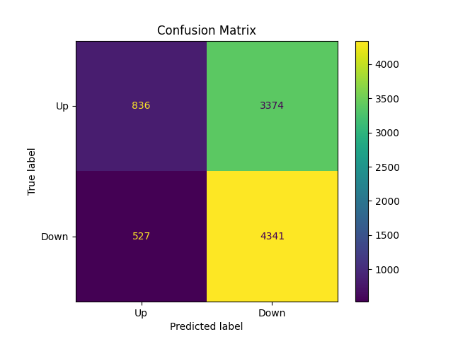
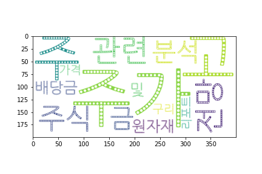
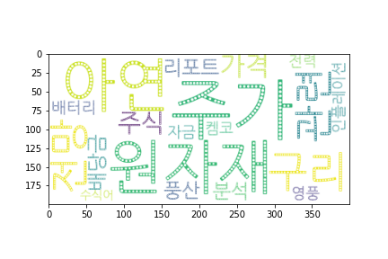
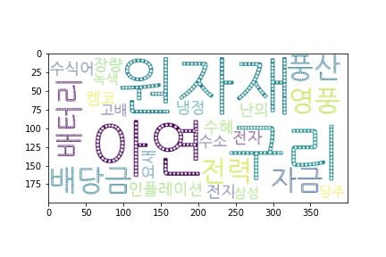
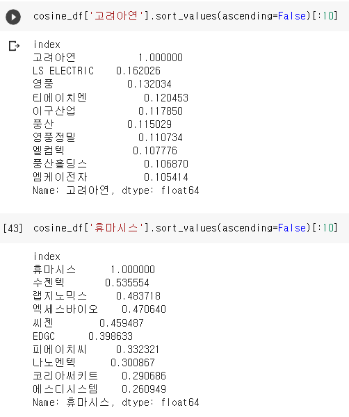
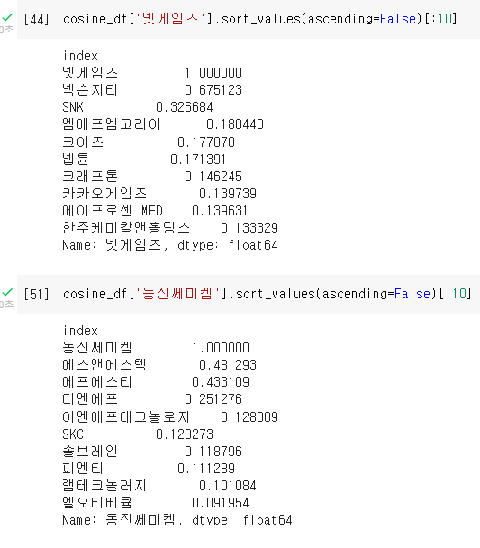
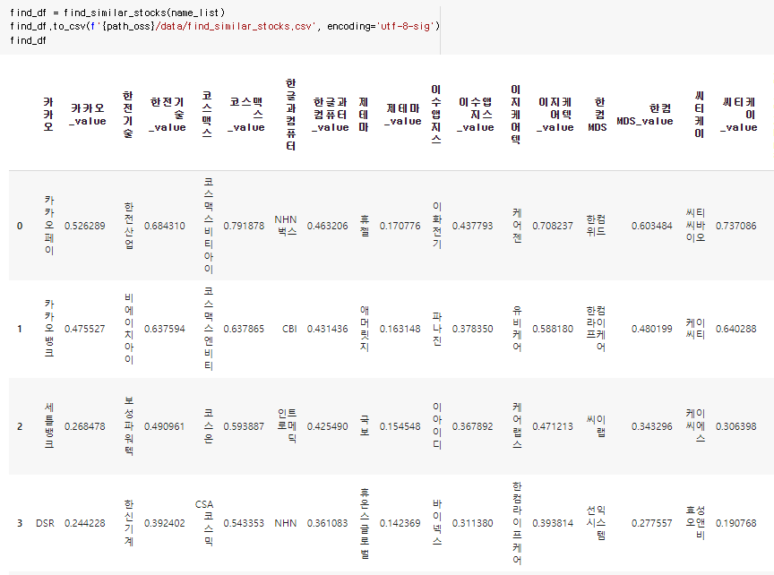

# Hot Stocks Information

## Description
해당 프로젝트는 한국주식(Kospi, Kosdaq) 분석을 위해 진행되었다.
주식 투자자가 모든 종목에 대한 이슈를 점검하는 것은 비효율적이므로 앞으로 유망할 종목을 선정한다.
선정된 종목에 대한 정보 수집, 자연어 처리과정을 통해 선정된 종목에 대한 압축된 정보와 키워드 기반 유사종목을 제공한다.
프로젝트의 진행과정은 다음과 같다.
#### 주식 데이터 수집 -> 지표 생성 -> 모델 학습 -> 종목 선정 -> 종목 정보 수집 -> 자연어 처리 -> 시각화, stock_contents.txt, 유사종목 파일 생성

## Files Descriptions
### *1. stock_list.py*
+ 국내주식종목(코스피+코스닥)리스트 생성
### *2. stock_indicator.py*
+ stock_list.csv와 pykrx모듈을 사용하여 국내주식OHLCV를 수집한다.
+ 사용할 지표를 생성하여 /data/OHLCV/*.csv 파일로 저장한다.
### *3. update_data.py*
+ 매일 stock_data.py를 사용하여 2500여개의 수년치 주가와 지표를 구하는 것은 비효율적이다.
+ 이전에 생성한 OHLCV파일에 저장되있는 최신 날짜부터 현재 날짜까지의 데이터를 수집하여 업데이트한다.
### *4. model.py*
+ 학습 대상 종목은 2500여개의 종목중 당일 종가가 볼린저밴드를 벗어난(최근 20거래일 중 최초로 벗어났을 때만)종목이다.
+ SVM을 이용해 학습 대상 종목중 오를 종목을 분류한다.
+ 2018년1월1일데이터부터 현재까지의 데이터를 0.75:0.25 비율로 train_set, test_set을 생성.
+ Input Feature: fluct, disparity5,20,60, mfi14, upperWidth, lowerWidth, marketCap,
  kospi_disparity5,20,60, kospi_mfi14(변수 설명은 Dataset Description 참고)
+ Label: 0,1(5거래일 후 종가가 현재 종가보다 높을 때 0 낮을 때 1)
+ Input Feature의 스케일이 다르기 때문에 remove_outlier()와 scaling()을 통해 이상치 제거와 스케일링을 한다.
+ 선정된 종목은 /data/selected_stock/*.csv에 저장된다
+ 정확도 57%지만, 오른다고 한 종목이 오를 확률은 61.3%

  
### *5.CrawlingAndNLP.iqphy*
+ 종목 관련 글 크롤링과 자연어처리 파트
+ py파일을 통해 생성된 것 중 stock_list.csv, /data/selected_stock/*.csv파일을
드라이브에 마운트해야 한다.
+ Setting 섹션에 date설정과 path_oss의 경로를 맞춰 줘야한다.
1. 타깃 종목들의 네이버 블로그, 카페, 인플루언서, 뉴스, 공시글을 크롤링하여 날짜stock_contents.txt 파일로 정리하여 한번에 정보를 볼 수 있게 한다.
2. 전체 종목의 네이버 블로그, 카페, 인플루언서, 뉴스글을 크롤링하여 명사만 간추려 total_stock_words.csv 파일로 저장(2~3시간 소요)
3. 전체 종목 corpus를 생성하여 빈도수 Top200 단어를 뽑고 stop_words를 정성적 판단하에 생성한다.
4. TF-idf 행렬을 만들고, 해당 종목의 상위 25개의 키워드를 뽑아 wordcloud를 생성한다.
5. TF-idf 행렬 기반 코사인 유사도 matrix를 생성하여 find_similar_stocks.csv파일로 저장하여 유사 종목을 뽑는다.

#### Ex) 2021년 12월 17일 선정된 '고려아연'

단어 빈도수만으로 wordCloud생성 시 '주가, 관련, 주식'등과 같이 해당 종목의 특성과 관련없는 단어들이 상위 포지션을 차지한다.

TF-IDF Matrix를 거친 후 '원자재, 아연, 구리'등 과 같이 고려아연이 영위하는 사업과 관련있는 단어들로 wordCloud가 생성 되었다.

stop_words까지 추가 한 최종 버전은 '풍산, 영풍'과 같이 같은 산업군에 속해있는 종목 키워드의 비중이 높아지고, '전지, 전력, 배터리'와 같이 새로운 핵심 키워드들이 추가되었다.
보여주는 단어 수가 많아진것도 있지만 전체적으로 핵심 키워드들이 두각을 보인다.

#### Ex) 2021년 12월 19일 기준 코사인 유사도 상위 종목 예시
\

산업별, 섹터별로 군집화된 전통적인 분류 방법은 시장의 트렌드를 놓치는 경우가 많다.
예시중 휴마시스는 대표적인 진단키트 테마주로써 코로나 상황이 심각한 현재 시장에서 진단키트주로 분류된다.
수젠텍 ~ 나노엔텍까지 전부 진단키트 관련주이고 잘 분류 된 것 같다.
넷게임즈의 경우 넥슨지티와 합병 소식이 나오며 급등한 종목이다.

#### Ex) 2021년 12월 21일 기준 코사인 유사도 상위 종목으로 유사종목 생성

## Dataset Descriptions
### 1. /data/stock_list.csv
+ 국내주식종목(코스피+코스닥) 리스트.
+ name: 종목명, ticker: 종목 티커(코드), marketCap: 시가총액
+ stock_list.py 실행시 생성한다.
### 2. /data/OHLCV/*.csv
+ 파일명은 종목코드로써 해당 종목의 정보를 담는다.
+ 날짜,시가,고가,저가,종가는 pykrx 모듈을 사용하여 얻는다.
+ MA: 이동평균선, disparity: 이격도, stddev: 표준편차, upper: BollingerBand(std=2)상단밴드, lower: BollingerBand(std=2)하단밴드,
  pmf = 양의 현금흐름, nmf = 음의 현금흐름, mfi14 : 14일 동안의 현금 흐름, touch: 종가가 BollingerBand 상/하단 이탈시 1기입, label: 일주일 뒤 상승하면 0 상승하지 않으면 1
+ stock_data.py를 실행하여 얻는다.
### 3. /data/kospi.csv, kosdaq.csv
+ 코스피, 코스닥 인덱스 정보
### 4. /data/today_stock.csv
+ 학습된 모델이 선정한 오늘 찾아볼 종목 리스트
### 5. /data/png/*.pnf
+ wordCloud 결과물
### 6. /sample/word_matrix.csv
+ 전체 종목 전체 단어간 TF-IDF Matrix(용량부족으로 업로드 불가. 코랩파일 확인)
### 7. /sample/cosine_similirity.csv
+ 전체 종목 간 코사인 유사도(용량부족으로 업로드 불가. 코랩파일 확인)
### 8. /sample/find_similirity_stocks.csv
+ 선정된 종목들의 코사인 유사도 상위 10종목 데이터프레임

## 업데이트 예정
+ 종목 헤드라인을 모아둔 텍스트 파일의 가독성 부족. HTML파일로 생성
+ word_cloud를 png파일로 보는것이 불편함. HTML파일로 생성

## Reference 
+ https://wikidocs.net/31698 (딥러닝을 이용한 자연어 처리 입문)
+ https://scikit-learn.org/stable/index.html (사이킷런)
+ https://github.com/sharebook-kr/pykrx (pykrx모듈)